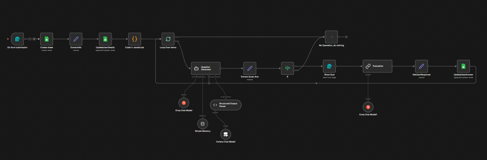

# 🚀 AI-Driven Technical Assessment Engine

An intelligent automated interview system built with [n8n](https://n8n.io/) and LangChain, designed to simulate a complete technical interview process for various technology roles.

## 🌟 Overview

This project orchestrates an end-to-end "AI Recruiter" that collects a candidate's profile, quizzes them with progressively difficult technical questions tailored to their expertise, evaluates their answers in real-time, and generates a structured performance report in Google Sheets for recruiters.

## ✨ Features

- **Dynamic Question Generation**: Automatically tailors questions using Large Language Models based on the candidate's applied role and years of experience.
- **Adaptive Difficulty Scaling**: Scales from basic syntax to advanced system architecture across a 10-question sprint.
- **Real-Time Evaluation**: Assesses candidate responses immediately against "ideal" AI answers and assigns an automated score (1-10).
- **Automated Data Persistence**: Creates and continuously updates a candidate performance dashboard in Google Sheets during the interview.
- **Multi-Role Support**: Easily configurable for Full Stack Developer, Web Designer, Frontend/Backend Developer, QA Tester, AI Engineer, and more.

## 🛠️ Architecture & Workflow

### Workflow Overview

#### Step-by-step Process:

1. **Candidate Onboarding**: The workflow begins with a web form accepting the candidate's Name, Age, Email, Target Role, and Experience level.
2. **Dashboard Setup**: Candidate details are instantly synced to a newly generated Google Sheet document.
3. **Interactive Interview Loop** (10 Iterations):
   - An **AI Agent** generates a specialized technical question using Structured Output Parsers.
   - The question is presented to the candidate via an automated Form prompt.
   - The candidate's response is captured and logged.
4. **Scoring & Evaluation**: An independent AI Evaluation step grades the candidate's submission against an expertly generated reference answer.
5. **Score Recording**: The exact question, expected answer, candidate's answer, and evaluation score are appended to the Google Sheet.

## 📄 Example Output

You can review a simulated evaluation report of how candidate answers are tracked and scored in the sample document:

- 📑 [View Sample Interview Output Report](Interview_output_sample.pdf)

## 💻 Tech Stack

- **Orchestration**: [n8n](https://n8n.io/)
- **AI / LLMs**: Groq (Llama, Qwen), Cohere
- **AI Frameworks**: n8n LangChain nodes (Agents, Memory Buffer Windows, Structured Output Parsers)
- **Data Storage**: Google Sheets Workspace API

## ⚙️ Setup and Usage

### Prerequisites

Before importing the workflow, ensure you have active accounts and API keys for the following services:

- **Groq API**: Required for the core question generation and evaluation logic (using Llama/Qwen models). Get a free API key at [Groq Cloud](https://console.groq.com/).
- **Cohere API**: Used as a supplementary LLM for specific LangChain tasks. Obtain an API key from the [Cohere Dashboard](https://dashboard.cohere.com/).
- **Google Cloud Console**: You need to set up a project and enable the **Google Sheets API**. Generate OAuth2 credentials so n8n can programmatically create and update spreadsheets.

### Step-by-Step Setup

1. **Prepare n8n Environment**: Ensure you are running n8n (either locally via self-hosting/Docker or on n8n Cloud).
2. **Import Workflow**:
   - Open your n8n UI.
   - Go to **Workflows** -> **Add Workflow**.
   - Click the options menu (top right) and select **Import from File**.
   - Upload the included `AI Interview.json` file.
3. **Configure Credentials**:
   - Open the LangChain Chat Model nodes ("Groq Chat Model", "Groq Chat Model1", and "Cohere Chat Model") and add your respective API keys.
   - Open the "Google Sheets" nodes and connect your Google Sheets OAuth2 account to grant n8n sheet-editing access.
4. **Prepare the Google Sheet Target**:
   - By default, the workflow handles sheet creation, but make sure your Google credentials have full Drive permissions.
5. **Activate & Test**:
   - Save the workflow.
   - Toggle the workflow switch to **Active** (in the top right corner).
   - Open the **Form Trigger** node to get the Webhook "Test URL" or "Production URL".
   - Open the URL in your browser to fill out a candidate profile and initiate the AI interview!

---

## 🤝 Support

- **Email**: [work.raj.38@gmail.com](mailto:work.raj.38@gmail.com)
- **Issues**: [GitHub Issues](https://github.com/RajTejani61/AI-Powered-Interview/issues)
- 

---

## 📄 License

This project is open source under the [MIT License](LICENSE).

[⬆️ Back to Top](#-ai-powered-interview-pipeline)

